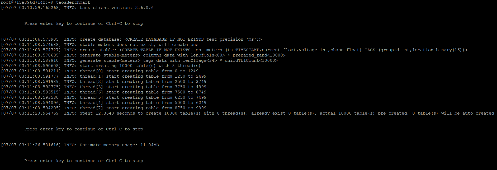
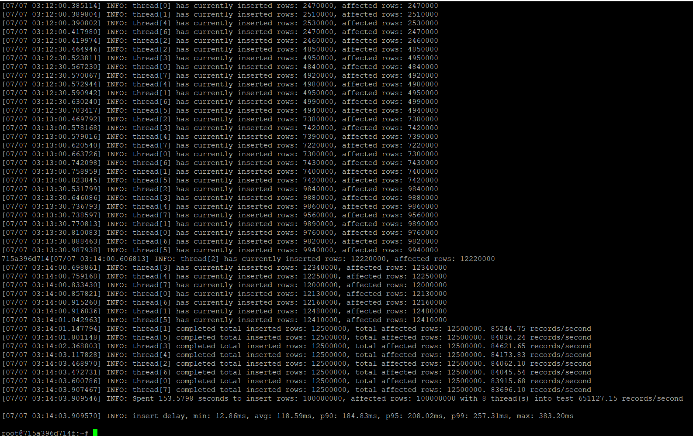

# Go to Taos Shell
> docker exec -it [YOUR CONTAINER ID HERE] /bin/bash

> taos

# We have Two Options Here:
 - ## Either Just Import Example Data Using taosBenchmark: 
> taosBenchmark

TDEngine is a powerful tool that can insert multiple data collection points keeping track of multiple metrics. 

We can see that 100 million records were inserted into database within just 153 seconds on my server!

 - ## Or Create Super Table By SQL Statement:
> create database if not exists test precision 'ms';
> use test;

> CREATE TABLE IF NOT EXISTS meters (ts TIMESTAMP, current FLOAT, voltage 
INT, phase FLOAT) TAGS (location BINARY(64), groupId INT);

- ## Finally
In either way, we have **finally created super table 'meters' on database 'test'**. 

Note that taosBenchmark also uses multi-threading to create tables with ids ranging from d0 to d9999 associated with super table 'meters', which takes quite astoundingly fast speed. 

However, we will still cover how to insert data in TDEngine later and will only query data we inserted manually in the following sections to gain further insight into how time-series dataset plays its role in practice.
