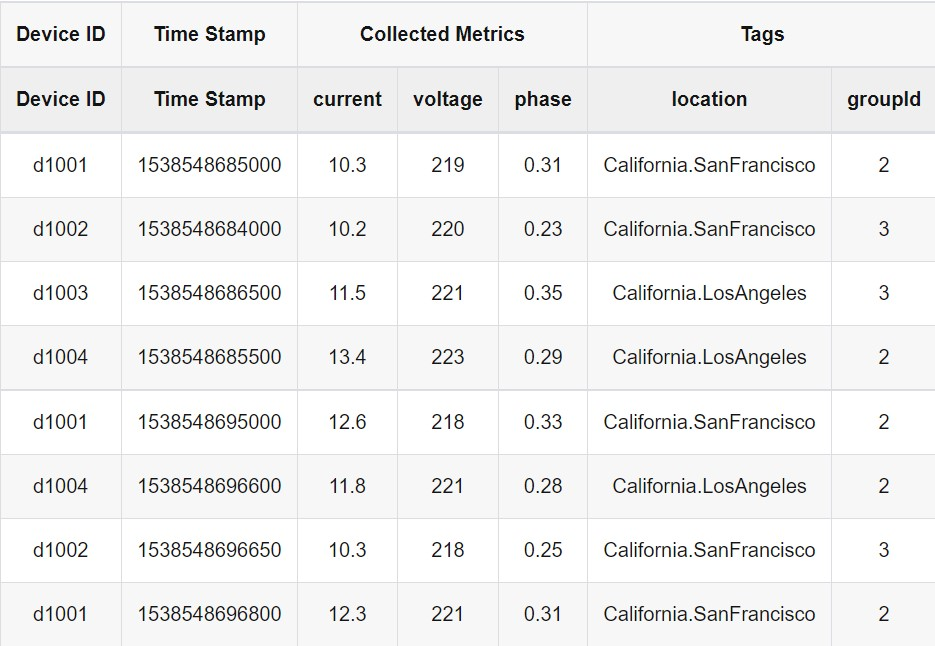

# Data Model
We're using smart meter data model example in TDEngine tutorial for our coursework.

We assume the following: 
1. Each smart meter collects three metrics i.e. current, voltage, and phase 
1. There are multiple smart meters, and 3. Each meter has static attributes like location and group ID. 

Based on this, collected data will look similar to the following table:

So here comes our goal for the coursework:

1. create a super table which manages data model according to labels like Device ID.
1. create tables with different IDs associated with this super table.
1. insert time series data to super table for each Device.
1. Do some time-series queries.

We will be tracking these four goals according to the execution sequences described in README.md, with pictures of execution results on my server provided as valid proof of code.