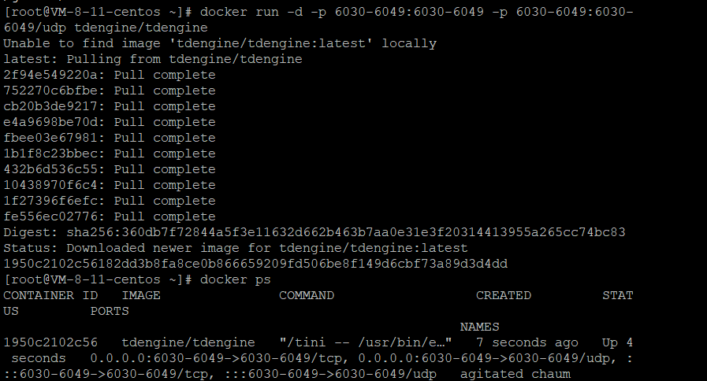
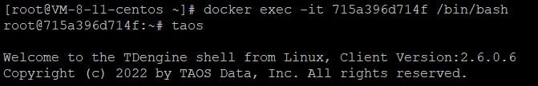

# Install
Install TDEngine on my centos linux server via docker.
> docker run -d -p 6030-6049:6030-6049 -p 6030-6049:6030-6049/udp tdengine/tdengine

We can view docker container ID for dbengine here
> docker ps

# Run On Docker
Container ID is 715a396d714f in our case here.
> docker exec -it [YOUR CONTAINER ID HERE] /bin/bash

