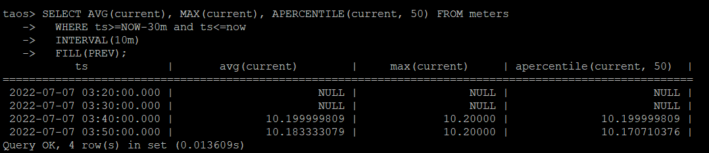
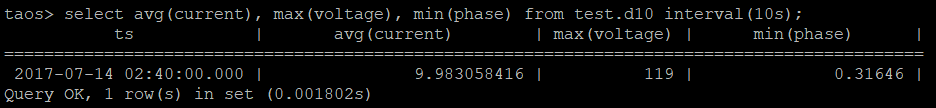

# On Super Table

For the data collected by the smart meter, take 10 minutes as a stage, calculate the average value, maximum value, and median value of the current data in the past 30 minutes. If no value is computed, fill with the previous non-NULL value. The query statement used is as follows:
>SELECT AVG(current), MAX(current), APERCENTILE(current, 50) FROM meters
  WHERE ts>=NOW-30m and ts<=now
  INTERVAL(10m)
  FILL(PREV);

# On Data Collection Point Table 
Aggregate statistics of average, maximum and minimum values by 10s for table with device ID d10:

>select avg(current), max(voltage), min(phase) from test.d10 interval(10s);

